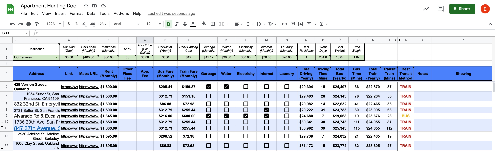

# Apartment-Hunting-Spreadsheet

When looking at apartments, there are many different factors at play which can make it difficult to assess the objective value of a rental. Some landlords will offer included utilities, but perhaps at a slight premium, while another cheaper apartment might require you to pay utilities on your own. Furthermore, factoring the cost of commuting can be an extremely important deciding factor. This spreadsheet allows you to organize all of these factors, and uses the Google Maps API to calculate yearly costs and commute times for each unit. 

Here is a preview of what a fully leveraged spreadsheet can look like.



## Setup

1. Download this repository. Upload the ```Apartment Hunting Doc.xlsx``` file to Google Drive.
2. Open the excel file as a Google Sheet. On the top bar, select "Script Editor" under "Tools".
3. Copy and paste the contents of ```custom_functions.js```
4. If you'd like to use the commuting calculation function, you're going to [need to set up a directions API key](https://developers.google.com/maps/documentation/javascript/get-api-key). Make sure you set a daily limit on requests so you don't end up being charged everytime you access the sheet.
5. Paste your API key in between the quotes of ```var Your_API_KEY = "";```.

## Usage
### Fixed Values
1. Start with the green rows up top. You'll need to fill in the values with estimates. 
  - ```Destination``` is the location you will be commuting to daily.
  - ```# of Residents``` can be helpful if you are trying to look with a roommate. It will split the monthly rent and utilities evenly, but assume you will be fully paying for your own commuting cost. If you'd like to get a sense of the full monthly cost, leave this set to 1. 
  - ```Cost Weight``` and ```Time Weight``` are used to set the ```Best Transit Method``` column. These are ultimately a personal preference based on what is most important to you. If having a short commute is 5x more important than saving money, you'd probably set it to 5x and 1x, respectively.

### Individual Listings

For each listing perform the following:

1. Enter the address in. This triggers a Google Maps search, so you might need to add the city and state if it starts getting confused.
2. Paste the link to the listing if applicable
3. Enter the monthly rent amount, application fees, and any other fixed fees.
4. Click the checkboxes if the utilitiy is included in the rent.

Once you have a list of apartments, you will start to be able to compare on the basis of yearly cost and daily commute time.
